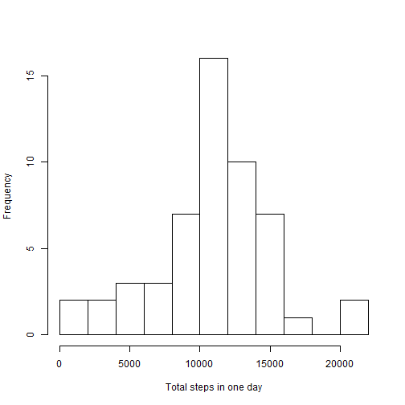
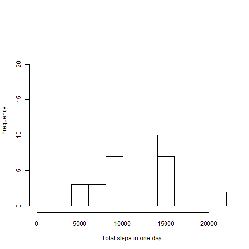
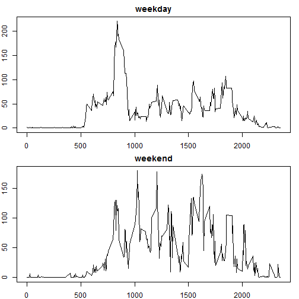

```r
#load packages
library(dplyr)

#set the number of decimals
options(scipen=1, digits=2)
```

The data comes from a csv file named Activity

```r
#read the data from a csv file
activity<-read.csv("./activity.csv")
```
<br/>
<br/>
<br/>
**What is mean total number of steps taken per day?**


```r
#sum the total number of steps
total_steps_per_day<-aggregate(x=activity$steps,by=list(activity$date),sum)

#rename the columns
total_steps_per_day<-rename(total_steps_per_day,date=Group.1,steps=x)

#plot the histogram
hist(total_steps_per_day$steps,breaks=10, xlab="Total steps in one day", main="")
```

 


```r
#calculate the mean
mean_steps<-mean(total_steps_per_day$steps,na.rm=TRUE)

#calculate the median
median_steps<-median(total_steps_per_day$steps,na.rm=TRUE)
```

The mean is **10766.19** and the median is **10765**.  
  
<br/>
<br/>
<br/>
**What is the average daily activity pattern?**


```r
#calculate the mean of steps of each interval
interval_mean<-aggregate(activity$steps,by=list(activity$interval),FUN=mean,na.rm=TRUE)

#rename the columns
interval_mean<-rename(interval_mean,interval=Group.1,steps=x)

#plot the graph
plot(interval_mean,type='l')
```

 


```r
#get the interval with the highest mean number os steps
max_interval<-subset(interval_mean$interval,interval_mean$steps==max(interval_mean$steps))
```
The 5-minute interval **835** contains the maximum number of steps.

<br/>
<br/>
<br/>
**Imputing missing values**


```r
#count the number of NAs
num_na<-sum(is.na(activity$steps))
```
The total number os NAs is **2304**  


```r
#this function will replace the NA value with the mean number of steps in that interval
fill<-function(interval,steps){
    if(is.na(steps)){
    m<-subset(activity$steps,activity$interval==interval,na.rm=TRUE)
    m<-mean(m,na.rm=TRUE)
    }
}

#create a new dataframe to get filled
activity_fill<-activity

#for each row of the dataframe
for (i in 1:nrow(activity_fill)){
  
  #if steps=NA
  if(is.na(activity[i,1])){
    
    #call the function fill
    #column 1: steps, column 3: interval
    activity_fill[i,1]<-fill(activity[i,3],activity[i,1])
    }
  
}

#sum the total number of steps of the filled dataframe
total_steps_per_day<-aggregate(x=activity_fill$steps,by=list(activity_fill$date),sum)

#rename the columns
total_steps_per_day<-rename(total_steps_per_day,date=Group.1,steps=x)

#plot the histogram
hist(total_steps_per_day$steps,breaks=10, xlab="Total steps in one day", main="")
```

 

```r
#calculate the mean
mean_steps<-mean(total_steps_per_day$steps,na.rm=TRUE)

#calculate the median
median_steps<-median(total_steps_per_day$steps,na.rm=TRUE)
```

The mean is **10766.19** and the median is **10766.19**.  
Replacing the NA values with the mean number of steps in that interval doesn't change the mean at all. But it does change the median, bringing it closer to the mean.

<br/>
<br/>
<br/>
**Are there differences in activity patterns between weekdays and weekends?**


```r
#get the day of the week of each date in the dataframe
day_of_week<-weekdays(as.Date(as.character(activity_fill$date)))

#separate the days in weekends and weekdays
#note that 'sábado'=saturday and 'domingo'=sunday in my system time
category<-ifelse(day_of_week %in% c("sábado","domingo"),"weekend","weekday")

#add the category to the dataframe as a factor
activity_week<-mutate(activity_fill,week=factor(category))

#allow the graphs to be a panel
par(mfrow=c(2,1),mar=c(2,2,2,1))

#get the weekdays
wkd<-subset(activity_week,week=="weekday")

#calculate the mean of steps of each interval during weekdays
wkd<-aggregate(wkd$steps,by=list(wkd$interval),FUN=mean,na.rm=TRUE)

#rename the columns
wkd<-rename(wkd,interval=Group.1,steps=x)

#plot the graph
plot(wkd,type='l', main="weekday", xlab="interval", ylab="steps")


#get the weekends
wke<-subset(activity_week,week=="weekend")

#calculate the mean of steps of each interval during weekends
wke<-aggregate(wke$steps,by=list(wke$interval),FUN=mean,na.rm=TRUE)

#rename the columns
wke<-rename(wke,interval=Group.1,steps=x)

#plot the graph
plot(wke,type='l', main="weekend", xlab="interval", ylab="steps")
```

 
